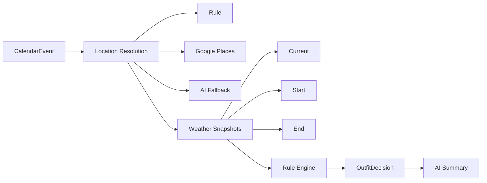
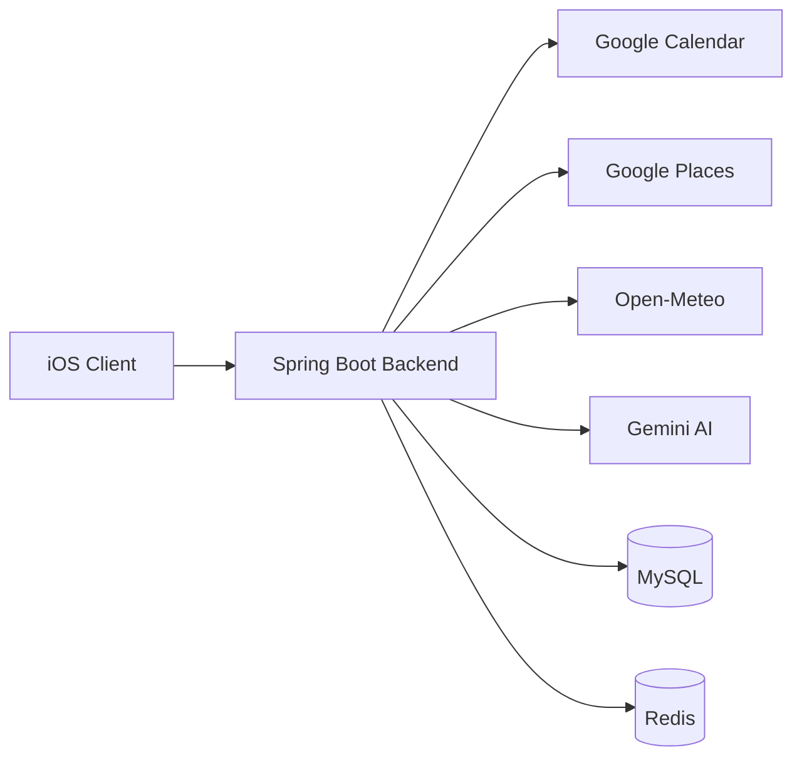
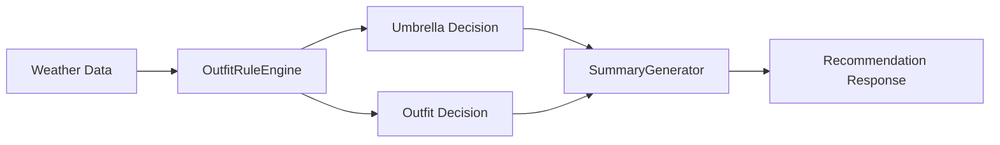

# wit-backend

일정, 위치, 시간대별 날씨를 함께 봐야 하는 외출 준비는 생각보다 번거롭습니다.  
사용자는 약속 장소의 날씨, 현재 위치와의 온도 차이, 비 여부, 시간대별 변화까지 직접 비교한 뒤
우산과 옷차림을 스스로 판단해야 합니다.

`wit-backend`는 이 과정을 자동화하는 Spring Boot 백엔드 MVP입니다.  
Google Calendar 일정, 위치 해석, 날씨 조회를 연결하고 **규칙 엔진**으로 우산 여부와 기능적 옷차림을 결정한 뒤,
마지막에 짧은 summary를 제공합니다.

핵심은 **규칙 엔진 기반 의사결정**이며, AI는 아래 2가지 역할로만 제한됩니다.

- location 자연어 해석 fallback
- 최종 summary 문장 생성

즉, **우산 판단 / 옷차림 판단 / 온도·강수 로직은 모두 코드가 담당**합니다.

---

## Problem → Solution → Value

### Problem

- 일정 앱과 날씨 앱이 분리되어 있어 외출 준비 판단이 끊겨 있음
- 사용자가 장소, 시간, 날씨 변화를 직접 조합해서 생각해야 함
- 비 여부와 옷차림 판단이 개인 감각에 의존하기 쉬움

### Solution

- Google Calendar 일정 조회
- 위치 해석
  - rule → Google Places → AI fallback
- 날씨 조회
  - current (optional) / start / end
- rule engine 기반 우산 / 옷차림 결정
- 최종 summary 생성

### Value

- 사용자는 “이 일정에 우산이 필요한지, 어떤 옷을 입어야 하는지”를 바로 확인할 수 있음
- 비정형 입력은 AI가 보조하지만, 최종 판단은 일관된 규칙으로 유지됨
- cache를 통해 비용과 응답 속도를 함께 관리할 수 있음

---

## 사용자 흐름

1. 사용자가 Google 연동을 완료합니다.
2. 서버가 향후 일정 최대 3개를 조회합니다.
3. 각 일정의 location을 해석합니다.
4. 현재 / 시작 / 종료 시점 날씨를 조회합니다.
   실제 현재 위치가 없으면 `currentWeather`는 만들지 않고, current 기반 비교를 생략합니다.
5. rule engine이 우산 여부와 옷차림을 결정합니다.
6. summary를 붙여 홈 추천 또는 이벤트 상세 추천으로 반환합니다.

---

## 현재 구현 범위

### 인증 / 일정 연동

- Google OAuth 로그인 URL 조회 및 callback 처리
- Google Calendar 일정 조회 연동
- 현재 구현 기준 Google integration 저장은 `in-memory repository` 사용

### 추천 기능

- 홈 추천 API
- 이벤트 상세 추천 API
- location resolver
  - rule → Google Places → AI fallback
- weather 조회
  - current (optional) / start / end 시점 사용
- fallback 응답 필드 제공
  - `locationFallbackApplied`
  - `fallbackNotice`
  - `weatherFallbackApplied`
  - `weatherSource`
  - `originalLocationResolution`

### 인프라 / 운영 보조

- location cache
- weather cache 및 latest cache fallback
- recommendation cache
- Swagger/OpenAPI 노출
- 추천 API 통합 테스트

현재 구현 기준 참고:

- cache는 Redis 기반입니다.
- 실제 현재 위치가 없으면 configured current location provider 결과를 사용합니다.
- 이 경우 `currentWeather`는 목적지 날씨로 대체하지 않고 `null`로 유지되며, current 기반 비교를 생략합니다.

---

## 핵심 흐름

이 프로젝트의 핵심은 일정 데이터를 추천 판단으로 변환하는 흐름입니다.



```text
CalendarEvent
  → ResolvedLocation
  → WeatherSnapshot (current optional / start / end)
  → Rule Engine
  → OutfitDecision
  → AI Summary
```

---

## 아키텍처

시스템은 iOS 클라이언트, Spring Boot 백엔드, 외부 API, 저장소로 구성됩니다.



레이어 구조:

- `domain`
  - core model
  - rule engine
- `application`
  - orchestration
  - use case
- `infrastructure`
  - external API
  - cache
  - config
- `presentation`
  - controller
  - API response

---

## 설계 철학

### 왜 rule engine이 핵심인가

추천 결과는 설명 가능하고 일관되어야 합니다.  
그래서 우산 여부, 옷차림, 온도/강수 판단은 모두 deterministic rule로 처리합니다.

### 왜 AI 역할을 제한하는가

AI는 비정형 입력 처리와 자연어 설명에만 강점을 쓰고,
비즈니스 판단 자체는 담당하지 않도록 경계를 분리했습니다.

### token/auth 책임 경계

- `filter/security`
  - 요청 인증, 인증 컨텍스트 설정, 접근 제어
- `application`
  - current user 기준 Google integration 조회
  - Google token 상태 평가, refresh, 재연동 필요 판단
- `domain`
  - token/auth/security 로직을 다루지 않음

### 왜 cache가 필요한가

location 해석, weather 조회, recommendation 결과는 반복 호출 가능성이 높습니다.  
Redis cache는 비용 절감과 응답 성능 개선을 위한 목적입니다.

---

## 주요 컴포넌트

추천 판단이 어떻게 만들어지는지 한눈에 보기 위한 흐름입니다.



- `OutfitRuleEngine`
  - 우산/옷차림 핵심 판단 담당
- `DefaultLocationResolver`
  - rule → Google Places → AI fallback 순서로 위치 해석
- `CachingWeatherClient`
  - weather cache와 latest cache fallback 처리
- `RecommendationService`
  - 추천 흐름 조립 및 degraded/fallback 결과 생성
- `SummaryGenerator`
  - summary 생성, 실패 시 deterministic fallback 사용

---

## 로컬 실행

### 사전 요구사항
- Java 21
- MySQL
- Redis

### 실행 방법 (Quick Start)
1. MySQL, Redis 실행: `docker-compose up -d mysql redis`
2. 애플리케이션 실행: `./gradlew bootRun`

→ `http://localhost:8080/swagger-ui/index.html` 에서 바로 확인할 수 있습니다.

기본 확인 경로:

- Swagger UI: `http://localhost:8080/swagger-ui/index.html`
- OpenAPI JSON: `http://localhost:8080/v3/api-docs`

최소 검증 순서:

1. `SPRING_PROFILES_ACTIVE=local` 확인
2. MySQL이 `localhost:${MYSQL_PORT}`에서 실행 중인지 확인
3. Redis가 `localhost:${REDIS_PORT}`에서 실행 중인지 확인
4. 앱 기동 후 Swagger UI와 OpenAPI JSON 접근 확인
5. 아무 API나 호출해 응답 헤더 `X-Trace-Id` 확인
6. 같은 요청 처리 로그에 동일한 `traceId=` 값이 찍히는지 확인

주의:

- 현재 로컬 실행은 MySQL과 Redis가 필요합니다.
- Google / Places / Gemini 값이 비어 있어도 앱 자체는 기동할 수 있지만, 해당 외부 연동 기능 검증은 제한됩니다.

---

## 환경 변수

### 최소 기동에 필요한 값

- `SPRING_PROFILES_ACTIVE=local`
- `MYSQL_PORT`
- `MYSQL_DATABASE`
- `MYSQL_USER`
- `MYSQL_PASSWORD`
- `REDIS_PORT`

### 외부 연동 검증에 필요한 값

실제 Google 연동, 위치 해석 fallback, AI summary까지 확인하려면 아래 값이 필요합니다.

- `GOOGLE_CLIENT_ID`
- `GOOGLE_CLIENT_SECRET`
- `GOOGLE_REDIRECT_URI`
- `GOOGLE_PLACES_API_KEY`
- `GEMINI_API_KEY`
- `GEMINI_MODEL`

### 선택 / 기본값 존재

- `CURRENT_LOCATION_NORMALIZED_QUERY`
- `OPEN_METEO_BASE_URL`
- `CURRENT_LOCATION_DISPLAY_LOCATION`
- `CURRENT_LOCATION_LAT`
- `CURRENT_LOCATION_LNG`
- `LOCATION_CACHE_TTL`
- `WEATHER_CACHE_TTL`
- `RECOMMENDATION_CACHE_TTL`
- `GOOGLE_OAUTH_STATE`

참고:

- weather provider 기본값은 Open-Meteo입니다.
- location 해석 실패 시 configured current location 기본값을 사용합니다.
- 실제 현재 위치가 없으면 `currentWeather`는 목적지 날씨로 대체하지 않고 `null`로 유지합니다.
- 날씨 조회 실패 시 최신 cache를 먼저 사용하고, 그것도 없으면 safe default 추천으로 내려갑니다.
- cache TTL은 location `24h`, weather `1h`, recommendation `30m` 기본값을 사용합니다.
- callback 계약은 `POST /api/integrations/google/callback` 기준입니다.
- 기존 `GET /api/integrations/google/callback`도 호환용으로 유지됩니다.

### 프로필 차이

- `test`
  - Spring 테스트 전용 프로필
  - 외부 연동과 cache는 mock/stub 기반으로 검증합니다.
- `local`
  - 기본 실행 프로필
  - 로컬 MySQL, Redis와 기본 env 값으로 최소 수동 확인에 사용합니다.
- `runtime`
  - 별도 전용 파일은 없고 배포 환경 env 주입 기준입니다.
  - `application.yaml` 기본값을 쓰되, 필요한 비밀값과 함께 DB 및 Redis 연결 정보는 환경 변수로 주입하는 전제를 유지합니다.

---

## 테스트 실행

전체 테스트:

```bash
./gradlew test
```

추천 API 통합 테스트:

```bash
./gradlew test --tests 'com.yunhwan.wit.presentation.api.recommendation.RecommendationApiIntegrationTest'
```

AI fallback wiring 테스트:

```bash
./gradlew test --tests 'com.yunhwan.wit.application.recommendation.RecommendationServiceAiFallbackWiringTest'
```

---

## 주요 API

- `GET /api/integrations/google/login-url`
  - Google OAuth 진입 URL 조회
- `POST /api/integrations/google/callback`
  - OAuth code/state 처리 후 연동 완료
- `GET /api/recommendations/home`
  - 향후 일정 최대 3건 추천 조회
- `GET /api/recommendations/events/{eventId}`
  - 단건 상세 추천 조회

상세 응답 스키마는 Swagger 또는 별도 API 문서를 참고하세요.

---

## 문서

- 설계 개요: [docs/design-overview-ko-v2.md](docs/design-overview-ko-v2.md)
- 아키텍처: [docs/architecture.md](docs/architecture.md)
- API 스펙: [docs/api-spec-ko.md](docs/api-spec-ko.md)
- 통합 테스트 가이드: [docs/integration-test.md](docs/integration-test.md)
- 개발 로그: [docs/dev-log](docs/dev-log)
